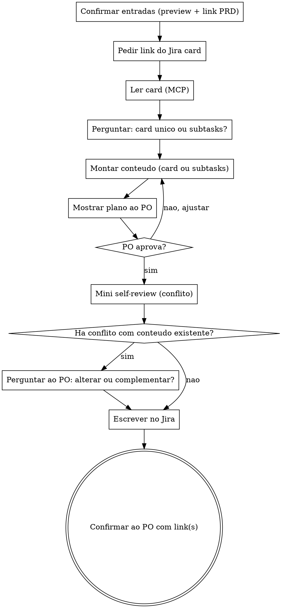

# Escrever Jira Card

Escreve no Jira card informado pelo PO o conteúdo já refinado (user story, critérios de aceite) e a referência ao PRD no Confluence, organizando tudo em um único card ou quebrando em subtasks, conforme decisão do PO.

## Cadeia de skills

```
refinamento  ->  escrever-prd  ->  escrever-jiracard
(entrevista)     (PRD no Confluence)  (card/subtasks no Jira)
```

Esta skill é a terceira e última da cadeia. Ela recebe o link da página do Confluence (PRD) criada pela `escrever-prd`, e o preview de negócio já aprovado, ambos presentes na conversa atual.

<HARD-GATE>
Não escreva nada no Jira sem o link do card informado pelo PO. Não decida por conta própria entre card único ou subtasks — isso é sempre uma pergunta ao PO. Se houver conflito com conteúdo já existente no card, pergunte ao PO se deve alterar ou complementar.
</HARD-GATE>

## Checklist

Você DEVE criar uma tarefa para cada item abaixo e completá-los em ordem:

1. **Confirmar as entradas disponíveis** — preview de negócio aprovado e link do PRD no Confluence (vindos da conversa atual); se estiverem ausentes, pedir ao PO
2. **Pedir o link do Jira card** onde o conteúdo será organizado
3. **Ler o card** via MCP Atlassian, para conhecer o conteúdo já existente
4. **Perguntar ao PO**: escrever tudo em um único card, ou quebrar em subtasks?
   - Se o PO estiver em dúvida, pode-se sugerir a quebra em subtasks como forma de facilitar a organização com o time técnico depois — mas a decisão final é sempre do PO
5. **Montar o conteúdo** a ser escrito (card único ou lista de subtasks propostas)
6. **Mostrar o plano ao PO** e aguardar validação
7. **Mini self-review** — checar conflito com o conteúdo já existente no card
8. **Se houver conflito**, perguntar ao PO: alterar ou complementar?
9. **Escrever no Jira** (atualizar o card e/ou criar as subtasks aprovadas)
10. **Confirmar ao PO** com o(s) link(s) final(is)

## Processo Flow



**O estado terminal é a confirmação da escrita no Jira.** Esta é a última etapa da cadeia — não há handoff para outra skill depois desta.

## O Processo

**Confirmando as entradas:**

- Reaproveite o preview de negócio aprovado e o link do PRD no Confluence, ambos já presentes na conversa (vindos de `refinamento` e `escrever-prd`).
- Se algum estiver ausente (por exemplo, a skill foi chamada isoladamente), peça ao PO para fornecer o conteúdo ou os links necessários antes de seguir.

**Lendo o card de destino:**

- Peça o link do Jira card onde o conteúdo será organizado.
- Use o MCP do Atlassian para ler o card (descrição, comentários, subtasks já existentes).
- Se o MCP do Atlassian não estiver configurado ou disponível na sessão, avise o usuário. Como alternativa, aceite um link com acesso OAuth/manual se o usuário preferir seguir sem o MCP.

**Decidindo a estrutura (card único vs. subtasks):**

- Pergunte diretamente ao PO: prefere que tudo fique em um único card, ou que o conteúdo seja quebrado em subtasks?
- Pode-se oferecer a sugestão de que a quebra em subtasks facilita a organização posterior com o time técnico, mas a escolha final é sempre do PO — não decida por conta própria.

**Montando e validando o plano:**

- Se card único: monte o conteúdo consolidado (user story, critérios de aceite, link do PRD).
- Se subtasks: proponha uma lista de subtasks com títulos e descrições em linguagem de negócio, cada uma referenciando o card principal e o PRD.
- Mostre o plano ao PO antes de escrever em qualquer lugar. Ajuste conforme feedback até aprovação.

**Mini self-review (antes de escrever):**

- **Conflito:** o conteúdo novo contradiz o que já existe no card (descrição, critérios ou subtasks já registradas)? Se sim, não decida por conta própria — pergunte ao PO se deve **alterar** o conteúdo existente ou **complementar/adicionar** preservando o que já está lá.

**Escrevendo no Jira:**

- Preserve o conteúdo já existente no card por padrão.
- Aplique a decisão do PO (alterar vs. complementar) exatamente como definida no self-review.
- Inclua o link da página do Confluence (PRD) na atualização, para rastreabilidade entre negócio e documentação.
- Após escrever, confirme ao PO com o(s) link(s) final(is) — card principal e, se aplicável, cada subtask criada.
