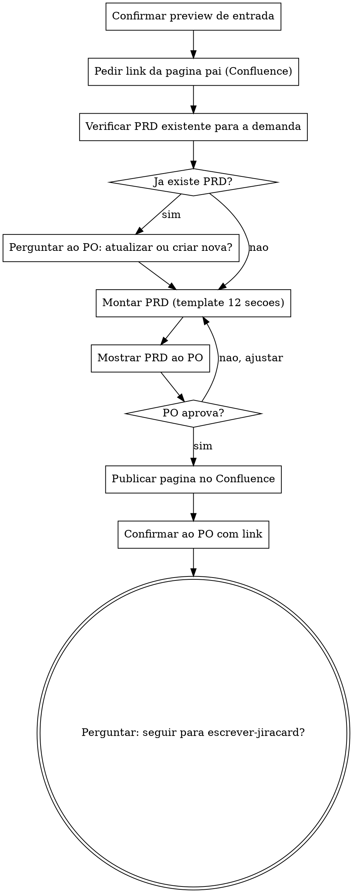

# Escrever PRD no Confluence

Transforma o preview aprovado de uma entrevista de refinamento (user story, critérios de aceite, fora de escopo) em um PRD estruturado e o publica como uma única página no Confluence.

## Cadeia de skills

```
refinamento  ->  escrever-prd  ->  escrever-jiracard
(entrevista)     (PRD no Confluence)  (card/subtasks no Jira)
```

Esta skill é a segunda da cadeia. Ela **não conduz entrevista** — usa o preview já aprovado, presente na conversa atual (produzido pela skill `refinamento`). Ao final, pergunta ao PO se deseja seguir para `escrever-jiracard`, passando o link da página do Confluence criada.

<HARD-GATE>
Não escreva nada no Confluence sem ter um preview de negócio já aprovado disponível na conversa (vindo da skill `refinamento`) e sem o link da página pai informado pelo PO. Se já existir uma página de PRD para a mesma demanda, não decida por conta própria — pergunte ao PO se deve atualizar a existente ou criar uma nova.
</HARD-GATE>

## Checklist

Você DEVE criar uma tarefa para cada item abaixo e completá-los em ordem:

1. **Confirmar o preview de entrada** — reaproveitar o preview aprovado na conversa (user story + AC + fora de escopo); se não houver um preview claro na conversa, pedir ao PO para colar o conteúdo ou rodar a skill `refinamento` antes
2. **Pedir o link/ID da página pai no Confluence** — a nova página será criada como filha dela
3. **Verificar se já existe um PRD para a mesma demanda** — buscar por título/contexto semelhante no Confluence
4. **Se existir conflito**, perguntar ao PO: atualizar a página existente ou criar uma nova
5. **Montar o PRD** usando o template de 12 seções (abaixo)
6. **Mostrar o PRD montado ao PO** e aguardar validação
7. **Publicar como uma única página** no Confluence (criar ou atualizar, conforme decisão do passo 4)
8. **Confirmar ao PO** com o link da página publicada
9. **Perguntar ao PO se deseja seguir para `escrever-jiracard`**, passando o link da página do Confluence como entrada

## Processo Flow



**O estado terminal é a pergunta de handoff para `escrever-jiracard`.** Esta skill não gera artefatos técnicos (sem OpenAPI, SDD, DDL, etc.) — o PRD é escrito em linguagem de negócio, igual à entrevista que o originou.

## Template do PRD (12 seções)

1. **Resumo Executivo** — 2-3 frases sobre o que é a demanda e por que importa
2. **Objetivo** — o que se espera alcançar
3. **Problema Atual** — a dor/situação de hoje, como veio da entrevista
4. **Solução Proposta** — o que vai mudar, em linguagem de negócio
5. **Fluxo de Negócio** — passo a passo de como o processo funciona (sem detalhe técnico)
6. **Casos de Uso** — cenários principais de uso, incluindo variações relevantes
7. **Critérios de Aceite** — os blocos Given/When/Then vindos do preview da entrevista
8. **Premissas** — o que está sendo assumido como verdadeiro
9. **Restrições** — limites conhecidos (prazo, regulatório, etc., em termos de negócio)
10. **Dependências** — o que essa demanda depende para acontecer (outras áreas, decisões, etc.)
11. **Riscos** — riscos de negócio identificados (não riscos técnicos/arquiteturais)
12. **Fora de Escopo** — o que explicitamente não está incluído

## O Processo

**Confirmando a entrada:**

- Reaproveite o preview já aprovado na conversa atual. Não peça ao PO para repetir a entrevista.
- Se a conversa não tiver um preview reconhecível (por exemplo, a skill foi chamada isoladamente, em uma sessão nova), peça ao PO para colar o conteúdo do preview ou rodar a skill `refinamento` primeiro.

**Localizando a página pai e checando duplicidade:**

- Peça o link ou ID da página pai no Confluence onde a nova página será criada como filha.
- Busque no Confluence por páginas com título ou conteúdo semelhante à demanda em questão.
- Se encontrar uma página de PRD já existente para a mesma demanda, não decida sozinho: pergunte ao PO se deve **atualizar** essa página ou **criar uma nova**.

**Montando e validando o PRD:**

- Preencha as 12 seções do template usando o conteúdo do preview de entrada e o contexto lido da issue de CONTEXTO (se disponível na conversa).
- Mostre o PRD montado ao PO antes de publicar. Ajuste conforme feedback até aprovação.

**Publicando:**

- Publique como **uma única página** contínua no Confluence — não fragmente o PRD em múltiplas páginas.
- Se a decisão foi "atualizar existente", preserve o histórico da página e aplique a atualização sem descartar informação sem necessidade.
- Confirme ao PO com o link da página final.

**Handoff para a próxima skill:**

- Pergunte: "Quer que eu escreva/organize isso no Jira agora?"
- Se o PO confirmar, oriente a seguir com a skill `escrever-jiracard`, passando o link da página do Confluence recém-criada/atualizada como entrada.
- Se o PO não quiser seguir agora, finalize normalmente.
