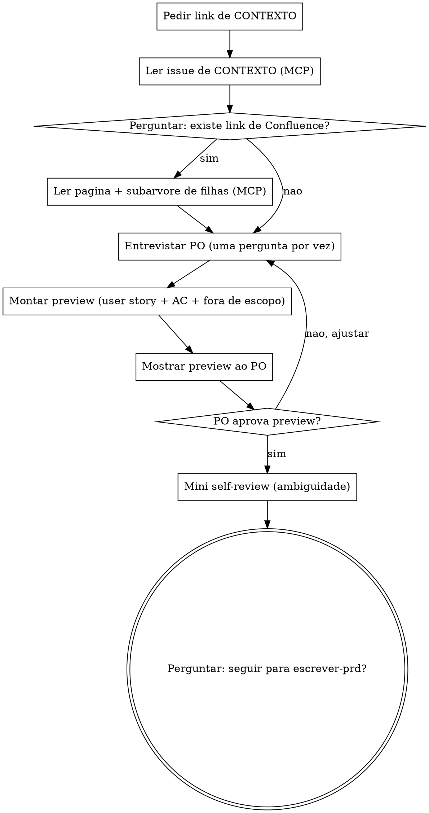

# Refinamento de Demandas de Negócio

Ajuda a transformar uma demanda de negócio ainda ambígua em uma história de usuário com critérios de aceite claros, através de uma entrevista conduzida com o Product Owner (PO), mantendo o vocabulário de negócio.

Esta skill é **só entrevista/discovery**. Ela não escreve em Jira nem em Confluence — essa responsabilidade é das skills seguintes na cadeia (`escrever-prd` e `escrever-jiracard`). Esta skill também cobre apenas o **refinamento de negócio**; o refinamento técnico é feito em uma etapa posterior, por outro processo — não aqui.

## Cadeia de skills

```
refinamento  ->  escrever-prd  ->  escrever-jiracard
(entrevista)     (PRD no Confluence)  (card/subtasks no Jira)
```

Esta skill é a primeira da cadeia. Ao final, ela pergunta ao PO se deseja seguir para `escrever-prd`, passando o preview aprovado (que já está na conversa) como entrada.

<HARD-GATE>
Não inicie a entrevista sem ter recebido o link do Jira de CONTEXTO. Não considere o preview pronto sem a confirmação explícita do PO.
</HARD-GATE>

## Guardrail de linguagem

- A skill NÃO introduz termos técnicos (API, banco de dados, arquitetura, etc.) nas perguntas que faz. As perguntas devem ser sempre sobre efeito de negócio: o que o cliente/usuário vive, o que ele pode ou não fazer, qual regra se aplica.
- A skill NÃO filtra ou traduz o que o próprio PO disser. Se o PO mencionar algo técnico (ex: "chamar a API do customer-service"), isso pode ser registrado exatamente como foi dito.
- Objetivo: preservar uma linguagem que um PO reconheça e valide sem esforço, sem impor tradução artificial sobre o vocabulário do próprio usuário.

## Guardrail de escopo de documentação (Confluence)

- Esta skill só lê Confluence se o PO fornecer explicitamente um link de página como documentação de contexto. Não há busca espontânea no Confluence.
- O escopo de leitura é **restrito à página informada e a toda a sua subárvore de páginas filhas** (filhas, netas, etc.), navegada via MCP Atlassian.
- A skill **NÃO avança** para fora dessa árvore em nenhuma hipótese: não sobe para a página pai, não segue links para outros espaços ou outras páginas do Confluence citados dentro do conteúdo lido, mesmo que pareçam relevantes.
- Se, durante a entrevista ou a leitura da documentação, surgir a necessidade de uma informação que estaria fora dessa árvore permitida, a skill **não busca por conta própria** — ela pergunta ao PO, como uma pergunta normal da entrevista, em linguagem de negócio.

## Checklist

Você DEVE criar uma tarefa para cada item abaixo e completá-los em ordem:

1. **Pedir link do Jira de CONTEXTO** — issue que será lida para entender a demanda atual
2. **Ler a issue de CONTEXTO** via MCP Atlassian
3. **Perguntar se há um link de Confluence com documentação adicional** — opcional; se o PO não tiver, seguir sem ele
4. **Se houver link de Confluence, ler apenas essa página e sua subárvore de filhas** via MCP Atlassian, respeitando o guardrail de escopo acima
5. **Entrevistar o PO** — uma pergunta por vez, focada em negócio
6. **Montar preview** — user story + critérios de aceite + fora de escopo
7. **Mostrar preview ao PO** e aguardar validação
8. **Mini self-review** — checar ambiguidade no preview aprovado
9. **Perguntar ao PO se deseja seguir para `escrever-prd`**, passando o preview como entrada

## Processo Flow



**O estado terminal é a pergunta de handoff para `escrever-prd`.** Esta skill não escreve em nenhum sistema externo e não invoca skills de implementação técnica.

## O Processo

**Coletando o link de contexto:**

- Peça o link do Jira de CONTEXTO antes de qualquer pergunta de entrevista. Sem ele, não avance.

**Lendo o contexto:**

- Use o MCP do Atlassian para ler a issue de CONTEXTO (título, descrição, comentários relevantes).
- Se o MCP do Atlassian não estiver configurado ou disponível na sessão, avise o usuário. Como alternativa, aceite um link com acesso OAuth/manual se o usuário preferir seguir sem o MCP.

**Lendo documentação do Confluence (opcional):**

- Pergunte ao PO se existe um link de Confluence com documentação adicional sobre a demanda. Se não houver, siga direto para a entrevista.
- Se o PO informar um link, leia essa página e toda a sua subárvore de páginas filhas (recursivamente) via MCP Atlassian.
- Nunca navegue para fora dessa árvore: não suba para a página pai, não siga links para outros espaços ou páginas citados dentro do conteúdo lido, mesmo que pareçam relevantes para a demanda.
- Se, durante a leitura ou a entrevista, faltar uma informação que só existiria fora dessa árvore permitida, não busque por conta própria — pergunte ao PO sobre esse ponto, como uma pergunta normal da entrevista, em linguagem de negócio.

**Entrevistando o PO:**

- Uma pergunta por vez. Se um tema precisar de mais profundidade, quebre em várias perguntas.
- Perguntas sempre em linguagem de negócio: qual o problema/dor atual, quem é afetado (persona), qual o resultado esperado, quais as regras de negócio e exceções, o que fica fora do escopo.
- Prefira perguntas de múltipla escolha quando possível, mas perguntas abertas também servem.
- Não introduza termos técnicos nas perguntas. Não corrija ou traduza termos técnicos que o PO usar espontaneamente — registre como foi dito.

**Montando o preview:**

- **User story:** "Como [persona], quero [ação], para [benefício]"
- **Critérios de aceite:** formato Given/When/Then, um bloco por cenário, incluindo as exceções levantadas na entrevista
- **Fora de escopo:** lista curta do que NÃO está incluído nesta demanda, para evitar retrabalho e expectativas erradas

**Mostrando o preview:**

- Apresente o preview completo ao PO.
- Pergunte explicitamente se está correto ou se algo precisa mudar. Repita o ciclo de ajuste até aprovação.

**Mini self-review (antes do handoff):**

- **Ambiguidade:** alguma frase da user story ou de um critério de aceite pode ser lida de duas formas diferentes? Se sim, reescreva para eliminar a dupla leitura e confirme novamente com o PO.

**Handoff para a próxima skill:**

- Após o preview aprovado e revisado, pergunte: "Quer que eu monte o PRD no Confluence com esse conteúdo agora?"
- Se o PO confirmar, oriente a seguir com a skill `escrever-prd`, usando o preview desta conversa como entrada (não é necessário salvar em arquivo).
- Se o PO não quiser seguir agora, finalize normalmente — o preview permanece disponível na conversa para uso posterior.
