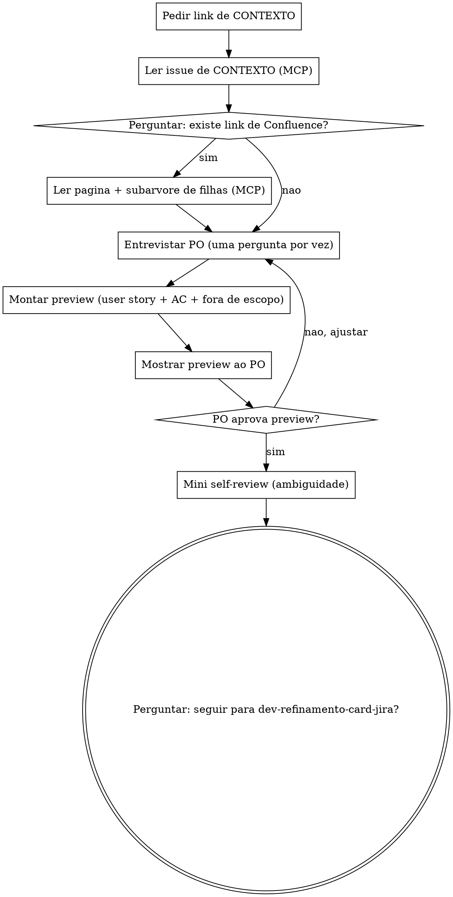

# Refinamento de Demandas de Negócio

Ajuda a transformar uma demanda de negócio ainda ambígua em uma história de usuário com critérios de aceite claros, através de uma entrevista conduzida com o Product Owner (PO), mantendo o vocabulário de negócio.

Esta skill é **só entrevista/discovery**. Ela não escreve em Jira nem em Confluence — essa responsabilidade é das skills seguintes na cadeia (`escrever-prd` e `escrever-jiracard`). Esta skill também cobre apenas o **refinamento de negócio**; o refinamento técnico é feito em uma etapa posterior, por outro processo — não aqui.

## Cadeia de skills

```
refinamento  ->  dev-refinamento-card-jira  ->  escrever-prd  ->  escrever-jiracard
(entrevista)     (avalia prontidão)             (PRD)            (Jira)
```

Esta skill é a primeira da cadeia. Ao final, ela pergunta ao PO se deseja seguir para `dev-refinamento-card-jira`, passando o preview aprovado (que já está na conversa) como entrada.

<HARD-GATE>
Não inicie a entrevista sem ter recebido o link do Jira de CONTEXTO. Não considere o preview pronto sem a confirmação explícita do PO.
</HARD-GATE>

## Guardrail de linguagem

- A skill NÃO introduz termos técnicos (API, banco de dados, arquitetura, etc.) nas perguntas que faz. As perguntas devem ser sempre sobre efeito de negócio: o que o cliente/usuário vive, o que ele pode ou não fazer, qual regra se aplica.
- A skill NÃO filtra ou traduz o que o próprio PO disser. Se o PO mencionar algo técnico (ex: "chamar a API do customer-service"), isso pode ser registrado exatamente como foi dito.
- Exceção controlada: quando o refinamento exigir alinhamento com o time técnico, a skill pode perguntar se o PO quer gerar um **contrato de informações em JSON, em inglês**, para validação de negócio antes do repasse técnico. Essa pergunta deve explicar o objetivo em linguagem simples: listar campos, significados, obrigatoriedade, regras e mensagens esperadas.
- Objetivo: preservar uma linguagem que um PO reconheça e valide sem esforço, sem impor tradução artificial sobre o vocabulário do próprio usuário.

## Guardrail de escopo de documentação (Confluence)

- Esta skill só lê Confluence se o PO fornecer explicitamente um link de página como documentação de contexto. Não há busca espontânea no Confluence.
- O escopo de leitura é **restrito ao Worktree Confluence informado pelo PO**: a página do link enviado e toda a sua subárvore de páginas filhas (filhas, netas, etc.), navegada via MCP Atlassian.
- Guardrail FORTE: a skill **NÃO consulta nada fora desse Worktree Confluence em nenhuma hipótese**. Não sobe para a página pai, não lê páginas irmãs, não segue links para outros espaços, não abre páginas de Confluence citadas no conteúdo lido e não faz busca paralela no Confluence, mesmo que pareçam relevantes.
- Se uma informação importante aparentar existir fora do Worktree Confluence permitido, a skill deve parar a exploração e perguntar ao PO, sem tentar buscar por conta própria.
- Se, durante a entrevista ou a leitura da documentação, surgir a necessidade de uma informação que estaria fora dessa árvore permitida, a skill **não busca por conta própria** — ela pergunta ao PO, como uma pergunta normal da entrevista, em linguagem de negócio.

## Checklist

Você DEVE criar uma tarefa para cada item abaixo e completá-los em ordem:

1. **Pedir link do Jira de CONTEXTO** — issue que será lida para entender a demanda atual
2. **Ler a issue de CONTEXTO** via MCP Atlassian
3. **Perguntar se há um link de Confluence com documentação adicional** — opcional; se o PO não tiver, seguir sem ele
4. **Se houver link de Confluence, ler apenas essa página e sua subárvore de filhas** via MCP Atlassian, respeitando o guardrail de escopo acima
5. **Entrevistar o PO** — uma pergunta por vez, focada em negócio, explorando canais, rollout, entregáveis, campos e exceções quando relevantes
6. **Montar preview** — user story + critérios de aceite + fora de escopo + canais/fluxo + campos/regras + exceções + entregáveis/rollout
7. **Mostrar preview ao PO** e aguardar validação
8. **Mini self-review** — checar ambiguidade no preview aprovado
9. **Perguntar ao PO se deseja seguir para `dev-refinamento-card-jira`**, passando o preview como entrada

## Processo Flow


```dot
digraph refinamento {
    "Pedir link de CONTEXTO" [shape=box];
    "Ler issue de CONTEXTO (MCP)" [shape=box];
    "Perguntar: existe link de Confluence?" [shape=diamond];
    "Ler pagina + subarvore de filhas (MCP)" [shape=box];
    "Entrevistar PO (uma pergunta por vez)" [shape=box];
    "Montar preview (user story + AC + fora de escopo)" [shape=box];
    "Mostrar preview ao PO" [shape=box];
    "PO aprova preview?" [shape=diamond];
    "Mini self-review (ambiguidade)" [shape=box];
    "Perguntar: seguir para dev-refinamento-card-jira?" [shape=doublecircle];

    "Pedir link de CONTEXTO" -> "Ler issue de CONTEXTO (MCP)";
    "Ler issue de CONTEXTO (MCP)" -> "Perguntar: existe link de Confluence?";
    "Perguntar: existe link de Confluence?" -> "Ler pagina + subarvore de filhas (MCP)" [label="sim"];
    "Perguntar: existe link de Confluence?" -> "Entrevistar PO (uma pergunta por vez)" [label="nao"];
    "Ler pagina + subarvore de filhas (MCP)" -> "Entrevistar PO (uma pergunta por vez)";
    "Entrevistar PO (uma pergunta por vez)" -> "Montar preview (user story + AC + fora de escopo)";
    "Montar preview (user story + AC + fora de escopo)" -> "Mostrar preview ao PO";
    "Mostrar preview ao PO" -> "PO aprova preview?";
    "PO aprova preview?" -> "Entrevistar PO (uma pergunta por vez)" [label="nao, ajustar"];
    "PO aprova preview?" -> "Mini self-review (ambiguidade)" [label="sim"];
    "Mini self-review (ambiguidade)" -> "Perguntar: seguir para dev-refinamento-card-jira?";
}
```

**O estado terminal é a pergunta de handoff para `dev-refinamento-card-jira`.** Esta skill não escreve em nenhum sistema externo e não invoca skills de implementação técnica.

## O Processo

**Coletando o link de contexto:**

- Peça o link do Jira de CONTEXTO antes de qualquer pergunta de entrevista. Sem ele, não avance.

**Lendo o contexto:**

- Use o MCP do Atlassian para ler a issue de CONTEXTO (título, descrição, comentários relevantes).
- Se o MCP do Atlassian não estiver configurado ou disponível na sessão, avise o usuário. Como alternativa, aceite um link com acesso OAuth/manual se o usuário preferir seguir sem o MCP.

**Lendo documentação do Confluence (opcional):**

- Pergunte ao PO se existe um link de Confluence com documentação adicional sobre a demanda. Se não houver, siga direto para a entrevista.
- Se o PO informar um link, trate essa página como a raiz do **Worktree Confluence** permitido e leia somente essa página e sua subárvore de páginas filhas (recursivamente) via MCP Atlassian.
- Nunca navegue para fora desse Worktree Confluence: não suba para a página pai, não leia páginas irmãs, não siga links para outros espaços ou páginas citados dentro do conteúdo lido, não execute busca global no Confluence e não tente completar lacunas com páginas fora da árvore, mesmo que pareçam relevantes para a demanda.
- Se, durante a leitura ou a entrevista, faltar uma informação que só existiria fora dessa árvore permitida, não busque por conta própria — pergunte ao PO sobre esse ponto, como uma pergunta normal da entrevista, em linguagem de negócio.

**Entrevistando o PO:**

- Uma pergunta por vez. Se um tema precisar de mais profundidade, quebre em várias perguntas.
- Perguntas sempre em linguagem de negócio: qual o problema/dor atual, quem é afetado (persona), qual o resultado esperado, quais as regras de negócio e exceções, o que fica fora do escopo.
- Prefira perguntas de múltipla escolha quando possível, mas perguntas abertas também servem.
- Não introduza termos técnicos nas perguntas. Não corrija ou traduza termos técnicos que o PO usar espontaneamente — registre como foi dito.

**Perguntas condicionais que devem ser exploradas quando forem relevantes ao contexto:**

- **Canais impactados:** pergunte se a iniciativa envolve app Android, app iOS, internet banking, portal PagInvest ou outro canal. Para cada canal aplicável, pergunte se o comportamento é igual em todos ou se há diferenças por canal.
- **Início e gatilho do fluxo:** pergunte o que inicia a funcionalidade ou fluxo: uma ação do usuário, uma rotina automática, uma data/horário, uma mudança de status, uma confirmação de outro processo, uma ação operacional ou outro evento de negócio. Pergunte também quando isso acontece, com qual frequência e quais condições precisam existir para o fluxo começar.
- **Fluxo de negócio:** peça ao PO para descrever o fluxo ponta a ponta em linguagem de usuário. Quando fizer sentido, pergunte se ele quer que você gere um fluxograma do fluxo para dar visibilidade antes do PRD.
- **Fluxo de telas:** quando houver experiência em canal digital, pergunte quais telas, etapas, confirmações, mensagens e estados o usuário deve ver. Pergunte onde o fluxo começa, onde termina, se existe retorno para tela anterior, cancelamento, revisão antes da confirmação ou comprovante/registro visível.
- **Automação e processamento:** quando a funcionalidade acontecer sem ação direta do usuário, pergunte se é um job/rotina automática, em qual momento deve rodar, qual evento dispara a execução, se há janela de processamento, se pode reprocessar, como o PO identifica sucesso/falha e quem acompanha o resultado.
- **Interação com sistema externo:** quando depender de retorno ou confirmação de outro sistema/parceiro, pergunte se o fluxo espera uma resposta imediata ou se continua depois. Se continuar depois, pergunte o que o usuário vê enquanto aguarda, qual prazo esperado, o que acontece se o retorno atrasar, vier negado, vier incompleto ou não vier.
- **Entregável esperado:** pergunte qual é o entregável de negócio da demanda: nova funcionalidade, alteração de uma funcionalidade existente, ajuste de regra, comunicação, relatório, operação interna, habilitação por canal ou outro resultado esperado.
- **Rollout:** pergunte se haverá rollout gradual. Se houver, pergunte a condição de entrada, condição de avanço, condição de parada, público inicial, canais incluídos, percentual/fatia de clientes, datas ou janelas relevantes e quem valida o avanço.
- **Versão de teste:** pergunte se existirá versão de teste, piloto, grupo controlado, ambiente de validação de negócio ou validação assistida. Se existir, pergunte quem participa, o que precisa ser validado, por quanto tempo e qual evidência define sucesso.
- **Funcionalidades envolvidas:** pergunte quais funcionalidades serão criadas, alteradas ou descontinuadas. Para cada funcionalidade, pergunte o comportamento esperado, quem usa, quando usa, resultado visível para o usuário e o que não deve mudar.
- **Campos utilizados:** pergunte quais campos, informações ou atributos serão usados na funcionalidade. Para cada campo relevante, pergunte nome de negócio, significado, origem informada pelo PO, obrigatoriedade, formato esperado, valores permitidos, valor padrão, regra de cálculo/preenchimento, se aparece para o usuário, se pode ser editado e em quais situações.
- **Contrato de informações:** quando houver troca estruturada de informações com time técnico ou outro sistema citada pelo PO, pergunte se o PO quer que você gere automaticamente um JSON em inglês com os campos do contrato para ele validar e repassar ao time técnico. Deixe claro que o JSON é um rascunho de negócio para validação, não uma decisão técnica final.
- **Exceções por funcionalidade:** para cada funcionalidade específica, pergunte os cenários de exceção: ausência de informação, informação inválida, valor fora da regra, tentativa fora do prazo, usuário sem permissão de negócio, canal indisponível, operação duplicada, cancelamento, expiração e qualquer restrição regulatória ou operacional.
- **Exceções por campo:** para cada campo com regra relevante, questione limites mínimos/máximos, casas decimais, datas permitidas, obrigatoriedade condicional, combinação inválida com outros campos, mensagem esperada para o usuário e ação permitida após o erro. Exemplo de pergunta: "Se o valor esperado para este campo for 10 e chegar 5, o que deve acontecer e qual mensagem o usuário deve ver?"

**Montando o preview:**

- **User story:** "Como [persona], quero [ação], para [benefício]"
- **Critérios de aceite:** formato Given/When/Then, um bloco por cenário, incluindo as exceções levantadas na entrevista
- **Canais, gatilhos e fluxo:** canais impactados, diferenças por canal, gatilho de início, momento/frequência de execução e resumo do fluxo validado com o PO. Inclua fluxograma textual ou Mermaid quando o PO pedir visualização do fluxo.
- **Telas, automações e dependências externas:** quando aplicável, registre fluxo de telas, rotina automática/job, janela de processamento, resposta imediata ou posterior de sistema externo, estados de espera, sucesso, falha e atraso.
- **Funcionalidades e campos:** liste funcionalidades criadas/alteradas, campos utilizados, significado de negócio, obrigatoriedade, regras, mensagens e dúvidas pendentes.
- **Entregáveis, rollout e teste:** registre entregável esperado, plano de rollout, condições de avanço/parada, versão de teste/piloto e evidências de sucesso, quando aplicáveis.
- **Contrato JSON (opcional):** se o PO aprovar, inclua um rascunho em inglês com os campos, tipos conceituais, obrigatoriedade, regras de negócio e mensagens esperadas para validação do PO e repasse ao time técnico.
- **Fora de escopo:** lista curta do que NÃO está incluído nesta demanda, para evitar retrabalho e expectativas erradas

**Mostrando o preview:**

- Apresente o preview completo ao PO.
- Pergunte explicitamente se está correto ou se algo precisa mudar. Repita o ciclo de ajuste até aprovação.

**Mini self-review (antes do handoff):**

- **Ambiguidade:** alguma frase da user story ou de um critério de aceite pode ser lida de duas formas diferentes? Se sim, reescreva para eliminar a dupla leitura e confirme novamente com o PO.
- **Cobertura de descoberta:** quando aplicável ao contexto, confirme se o preview responde claramente: canais impactados, fluxo, funcionalidades, campos, exceções por funcionalidade, exceções por campo, entregável, rollout, versão de teste e contrato JSON opcional. Se faltar algo relevante, volte à entrevista com uma pergunta por vez.

**Handoff para a próxima skill:**

- Após o preview aprovado e revisado, pergunte: "Quer que eu avalie a prontidão do card com a skill `dev-refinamento-card-jira` agora?"
- Se o PO confirmar, oriente a seguir com a skill `dev-refinamento-card-jira`, usando o preview desta conversa como entrada (não é necessário salvar em arquivo).
- Se o PO não quiser seguir agora, finalize normalmente — o preview permanece disponível na conversa para uso posterior.
